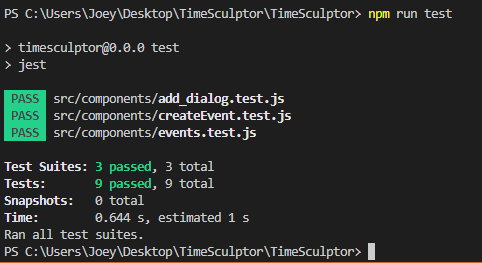
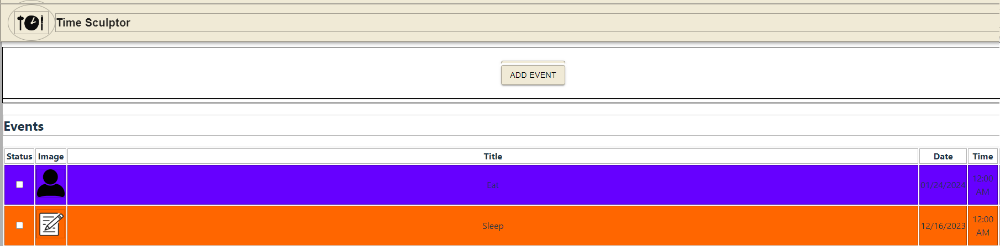
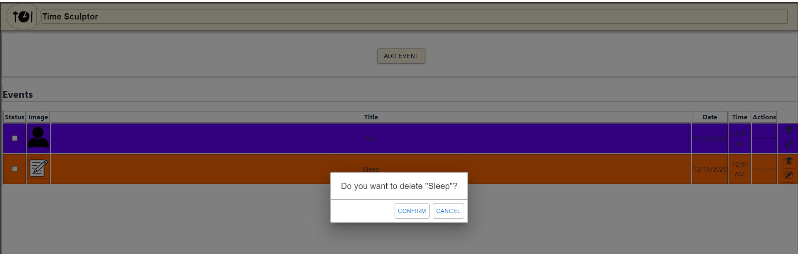
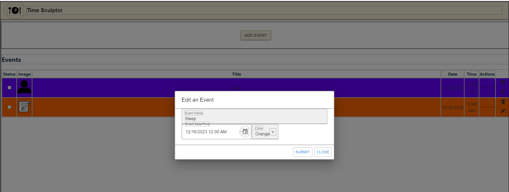
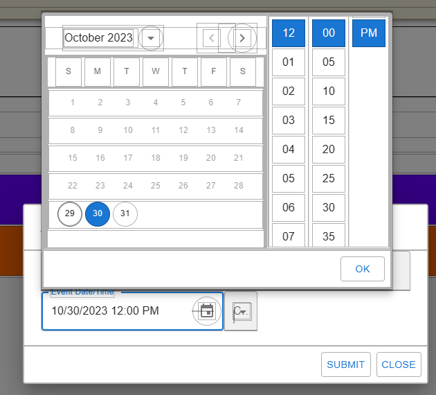
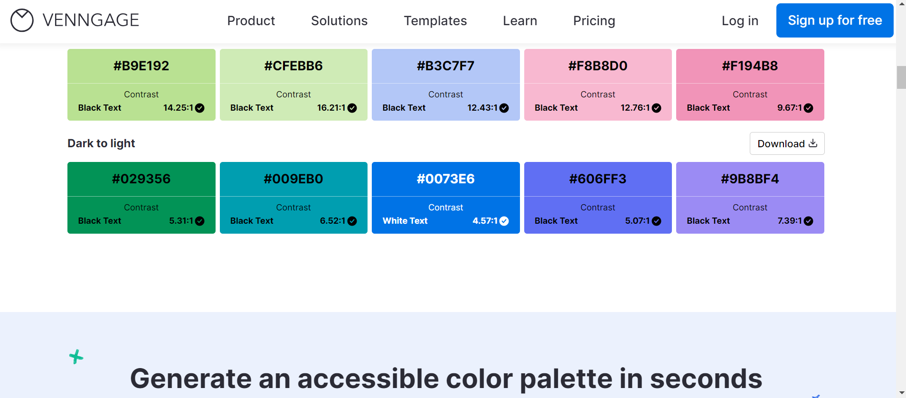
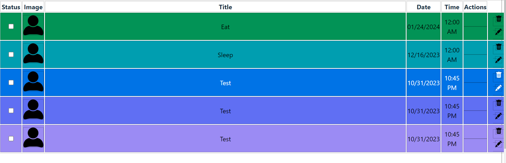

# Analysis

Group 4: **TimeSculptor**

**Date:** October 30, 2023

**Group Members:**

- Gabriel Valentin
- Izaac Molina
- Joey Banazsak
- Kimberly Allison
- Nicholas Wiley
- Noah Schwartz

# Introduction
TimeSculptor is a scheduling app; targeted for people who struggle ADHD; provides a much easier and accessible interface for those people and features ADHD friendly User Interface. The expected consumer segment are individuals suffering from ADHD. Upon logging in, you are then given the options to create events or edit your schedule's current events. You can utilize color coding, and assigning different symbols to your events. 

[TimeSculptor](https://github.com/nickw409/TimeSculptor)

# Implemented Requirements

List in this section, the requirements and associated pull request that you implemented for this release, following the example below---
include the description of the requirement, a link to the issue, a link to the pull request(s) that implement the requirement, who implemented the requirement, 
who approved it, and a print screen that depicts the implemented feature (if applicable). I expect that you implement the features you specified in your MVP (c.f. D.2 Requirements).

**Requirement:** change color switcher to preset colors, change red borders to black/no borders (depending on where)   
**Issue:** <https://github.com/nickw409/TimeSculptor/issues/57>  
**Pull request:** Fixes some CSS and changed the color picker from an HTML5 color pallette to the 3 primary and 3 secondary colors   
**Implemented by:** Noah Schwartz  
**Approved by:** Nick Wiley  
**Print screen:**   

**Requirement:** User login with credentials username, password.  
**Issue:** <https://github.com/nickw409/TimeSculptor/issues/49>   
**Pull request:** <https://github.com/nickw409/TimeSculptor/pull/52>   
**Implemented by:** Nick Wiley   
**Approved by:** Izaac Molina   
**Print screen:**    

**Requirement:** implement testing for the program
**Issue:** [54](https://github.com/nickw409/TimeSculptor/issues/54)     
**Pull request:** adding the tests [53](https://github.com/nickw409/TimeSculptor/pull/53)   
**Implemented by:** Joey Banaszak  
**Approved by:** Izaac Molina  
**Print screen:**    

**Requirement:** Implement basic UI and Event display Layout   
**Issue:** [44](https://github.com/nickw409/TimeSculptor/issues/44)  
**Pull request:** [35](https://github.com/nickw409/TimeSculptor/pull/36)  
**Implemented by:** Izaac Molina  
**Approved by:** Nick Wiley   
**Print screen:**   

**Requirement:** Edit and delete events from the display using action buttons  
**Issue:** [46](https://github.com/nickw409/TimeSculptor/issues/46)     
**Pull request:** [48](https://github.com/nickw409/TimeSculptor/pull/48)   
**Implemented by:** Izaac Molina   
**Approved by:** Nick Wiley  
**Print screen:**    

**Requirement:** Added a dropdown calendar for event date and time input           
**Issue:** [45](https://github.com/nickw409/TimeSculptor/issues/45)                
**Pull request:** [55](https://github.com/nickw409/TimeSculptor/pull/55)               
**Implemented by:** Kimberly Allison            
**Approved by:** Nick Wiley                
**Print screen:**     

# Tests

For the testing of our program we decided to use jest as our automated testing software. 

An example of one of the test cases is the [events file](https://github.com/nickw409/TimeSculptor/blob/main/TimeSculptor/src/components/events.jsx) being tested by the [events.test file](https://github.com/nickw409/TimeSculptor/blob/main/TimeSculptor/src/components/__tests__/events.test.js). 
In this test we currently test to see that when an event is added to the users schedule, that it matches the information put in and that the data of the event is properly stored. 

link for testing: [Here](https://github.com/nickw409/TimeSculptor/tree/main/TimeSculptor/src/components/__tests__)

Below is the output of the current tests being ran:

# Adopted Technologies

TimeSculptor is built in Javascript using Node.js and React.js, and will implement a SQL database. Node and React are common frameworks for web backend/frontend respectively, so they are not only reliable and have multiple features, but also are easier to learn due to their high level nature and breadth of available resources for learning the technologies. SQL is being used as it is what the group is most familiar with, and is an industry standard for database administration.

# Learning / Training

The team used a self directed approach to learning. This entailed learning the fundamentals of Javascript, then applying them to the required frameworks. For example, one tutorial series used was the [React tutorial series by Net Ninja](https://youtube.com/playlist?list=PL4cUxeGkcC9gZD-Tvwfod2gaISzfRiP9d&si=QC_JCSoPEDyJ02JL). Additionally, the team shared what they learned during meetings to solidify the groups' overall understanding of the technologies being used. Overall, this methodology enabled flexibility and approachability that enabled the team to learn the assigned technologies.

# Deployment

http://enginick.com:9696

The system is being deployed on a Hostwinds server. The client connects to a Node server listening on port 9696 that servers a static React page
responsible for all UI. The server is also home to a REST API used to get user authentication.

# Licensing

Inform the license you adopted for your source code (remember to configure GitHub accordingly). Explain why you adopted this license. For more information, check https://choosealicense.com/.

# Readme File

[CODE_OF_CONDUCT.md](https://github.com/nickw409/TimeSculptor/blob/main/CODE_OF_CONDUCT.md)
[CONTRIBUTING.md](https://github.com/nickw409/TimeSculptor/blob/main/CONTRIBUTING.md)

# Look & Feel

- One design choice was to use a color scheme created by [Venngage](https://venngage.com/tools/accessible-color-palette-generator) which is a color pallete creator based on the [WCAG](https://www.w3.org/WAI/standards-guidelines/wcag/) guidelines of making websites accessible. Quote pulled from Vennage: "The color pairings follow WCAG 2.1 AA based on a contrast ratio of 4.5:1. The pairings have sufficient contrast for use with normal text, large text and graphics."

# Lessons Learned

Throughout the course of creating this first release, we have learned a lot about the use of react.js, node.js, and jest.

# Demo

[TimeSculptorDemo](https://us04web.zoom.us/clips/share/BHVzMDQgk0IoAwByjY7bsPfttzbwm0oP82jQwe-Q-KXyR24fzQc)
