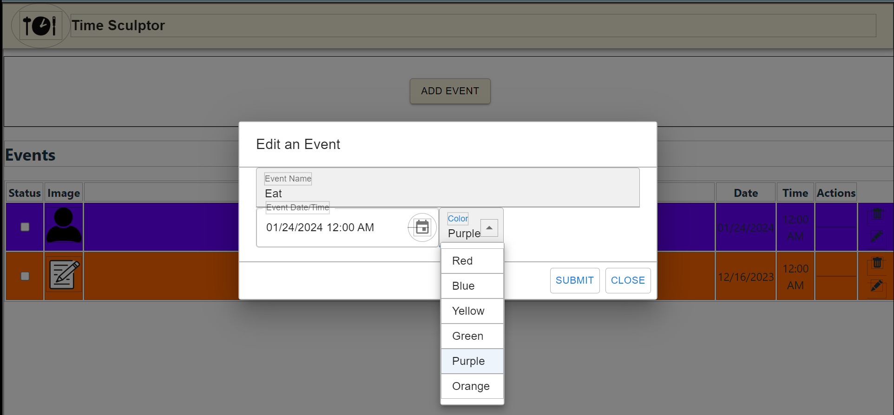

# Analysis

Group 4: **TimeSculptor**

**Date:** October 29, 2023

**Group Members:**

- Gabriel Valentin
- Izaac Molina
- Joey Banazsak
- Kimberly Allison
- Nicholas Wiley
- Noah Schwartz

# Introduction
TimeSculptor is a scheduling app; targeted for people who struggle ADHD; provides a much easier and accessible interface for those people and features ADHD friendly User Interface. The expected consumer segment are individuals suffering from ADHD. Upon logging in, you are then given the options to create events or edit your schedule's current events. You can utilize color coding, and assigning different symbols to your events. 

[TimeSculptor](https://github.com/nickw409/TimeSculptor)

# Implemented Requirements

List in this section, the requirements and associated pull request that you implemented for this release, following the example below---
include the description of the requirement, a link to the issue, a link to the pull request(s) that implement the requirement, who implemented the requirement, 
who approved it, and a print screen that depicts the implemented feature (if applicable). I expect that you implement the features you specified in your MVP (c.f. D.2 Requirements).

Example:
Requirement: As someone who associates events with pictures, I would like to label events with pictures. 
Issue: <link to your GitHub issue>
Pull request: 
Implemented by: Gabriel Valentin
Approved by: 
Print screen: 

Requirement: change color switcher to preset colors, change red borders to black/no borders (depending on where) 
Issue: https://github.com/nickw409/TimeSculptor/issues/57
Pull request: Fixes some CSS and changed the color picker from an HTML5 color pallette to the 3 primary and 3 secondary colors 
Implemented by: Noah Schwartz
Approved by: Nick Wiley
Print screen: 

Example:
Requirement:
Issue: <link to your GitHub issue>
Pull request: 
Implemented by: 
Approved by: 
Print screen: 

Example:
Requirement:
Issue: <link to your GitHub issue>
Pull request: 
Implemented by: 
Approved by: 
Print screen: 

Example:
Requirement:
Issue: <link to your GitHub issue>
Pull request: 
Implemented by: 
Approved by: 
Print screen: 

Example:
Requirement:
Issue: <link to your GitHub issue>
Pull request: 
Implemented by: 
Approved by: 
Print screen: 

# Tests

You should implement automated tests that aim to verify the correct behavior of your code. Provide the following information:

Test framework you used to develop your tests (e.g., JUnit, unittest, pytest, etc.):
Link to your GitHub folder where your automated unit tests are located.
An example of a test case. Include in your answer a GitHub link to the class being tested and to the test.
A print screen showing the result of the execution of the automated tests. 

# Adopted Technologies

List the adopted technologies with a brief description and justification for choosing them.

# Learning / Training

Describe the strategies employed by the team to learn the adopted technologies. 

# Deployment

Provide a link for the system in production and describe how you are deploying your system. 

Some alternatives for deploying your system in the cloud: 
AWS. AWS Educate offers free credits for students. See the tutorial at https://docker-curriculum.com/ on how to create a container and deploy it on AWS. 
Digital Ocean or Azzure. As part of the GitHub Education benefits, as a student, you can get $100 at Digital Ocean and $100 at Microsoft Azzure cloud computing platforms (see more details at https://education.github.com/students).
Oracle Cloud. Oracle offers a free tier in its cloud environment that should be more than enough for your needs.
Firebase. Firebase can be a good choice if you are building a mobile phone app. 

# Licensing

Inform the license you adopted for your source code (remember to configure GitHub accordingly). Explain why you adopted this license. For more information, check https://choosealicense.com/.

# Readme File

You should also prepare your repository for receiving new contributors. You should prepare a Readme.md file. See an example at https://gist.github.com/PurpleBooth/109311bb0361f32d87a2   
In the Readme file, the current version should be stated. You should follow the Semantic Versioning schema (https://semver.org/). Tag the GitHub repository accordingly (https://git-scm.com/book/en/v2/Git-Basics-Tagging). 

[CODE_OF_CONDUCT.md](https://github.com/nickw409/TimeSculptor/blob/main/CODE_OF_CONDUCT.md)
[CONTRIBUTING.md](https://github.com/nickw409/TimeSculptor/blob/main/CONTRIBUTING.md)

# Look & Feel

Describe the approach you adopted to design your user interface. Include some screenshots.

# Lessons Learned

In retrospective, describe what your team learned during this first release and what you are planning to change for the second release. 

# Demo

Include a link to a video showing the system working.
