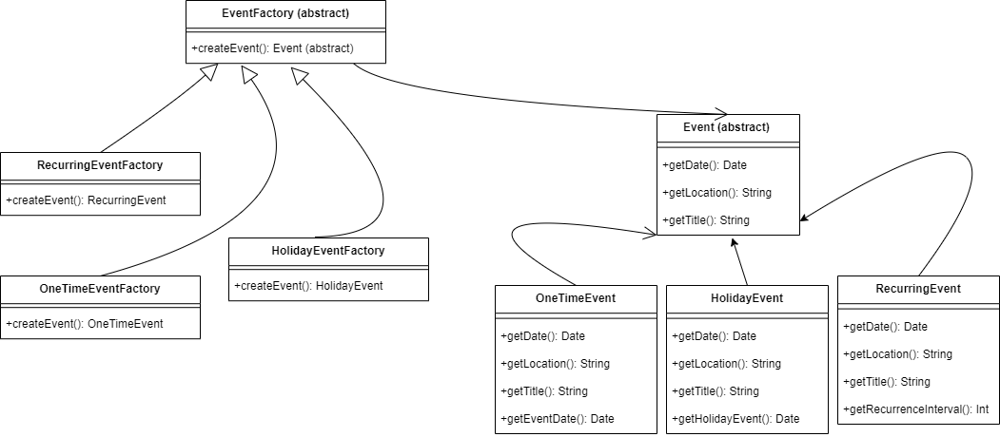

# Description
UI design is often built around the needs of neurotypical people. As a result, many apps miss UI features that improve ease of use for people with learning disabilities. One example of this is with Calendar apps, which, while extensive, often have complex UIs that aren't learning disability friendly. As a result, there should be a calendar app that prioritizes accessibility by following UI guidelines that accomodate those with learning disabilities. For those that have a learning disability who could greatly benefit from a scheduling app designed specifically with their needs in mind, TimeSculptor accommodates these needs by adhering to UI styling guidelines laid out by [Pavlov (2014)](https://www.scirp.org/html/7-9301792_43152.htm) and [Moreno et al. (2023)](https://link.springer.com/article/10.1007/s10209-023-00986-z). For example, Pavolv (2014) states that a key aspect of accesibile UIs is to ensure that all ideas have an associated picture. Apps like Google Calendar, Outlook, and Apple Calendar do not prioritize this, as events are typically just shown as text (with some niche exceptions like birthdays in Google Calendar). TimeSculptor will put these needs at the forefront, ensuring that the app adheres as closely as possible to them. Overall,
TimeSculptor is a scheduling app built for people with learning disabilities, our expected consumer segment. It provides a much easier and accessible interface that adheres to research based on building UI that is learning disability friendly.

The system requirements for TimeSculptor are defined thusly. First, **users** must be able to register with a valid _email_, _username_, and _password_. Each **user** will also **_have_** different personalized **settings**, which enable them to personalize their experience. For example, they can change their **notification** preferences, such as turning them _on/off_ or changing the _frequency_ at which notifications are sent. Each **notification** has a set _date_ it is sent out, as well as _content_ that will remind the **user** to update their **schedule**, and/or of upcoming **events**. Aside from this, the **user** can build a **schedule** that is **_tied to them_**, which is **_comprised_** of **days** will **_contain_** various **events**. The **schedule** will have different _view options_, such as list, daily, or weekly. The **schedule** also **_has_** inidividual **days**, which have a _date_, possible associated _holidays_, and have **events** that are **_scheduled within_** them. Each **event** **_contained_** within the **schedule** will have relevant information, like the _name_, _date_, _start time_, _end time_, _associated color_, and _related picture_. There are also **_recurring events_** which **_are a_** form of event that reoccur on a _time interval_, such as daily, weekly, or monthly. Another feature of TimeSculptor will be that it allows **users** to be **_friends_**, enabling users to compare their **schedules** via **compare requests**. In these **compare requests**, a **user** will **_initiate_** a request, which can then be **_accepted_** by another **user**. These **compare requests** will have a _header_, _content_, _sent date_, and _accepted date_. Once **_accepted_**, each of the **users** can use the **compare request** to **_view_** the other's **schedule** in order to schedule an **event** together.

# Architecture
Present a diagram of the high-level architecture of your system. Use a UML package diagram to describe the main modules and how they interrelate. See some examples at [here](https://www.uml-diagrams.org/package-diagrams-examples.html). Make clear the layers of your architecture (if they exist) as described in [here](https://www.uml-diagrams.org/multi-layered-application-uml-model-diagram-example.html). Provide a brief rationale of your architecture explaining why you designed it that way.

*Grading criteria (5 points): Adequate use of UML; Adequate design of an architecture for the system; Adequate description of the rationale.*

# Class Diagram
Present a refined class diagram of your system, including implementation details such as visibilities, attributes to represent associations, attribute types, return types, parameters, etc. The class diagram should match the code you have produced so far, but not be limited to it (e.g., it can contain classes not implemented yet).

The difference between this class diagram and the one that you presented in D.3 is that the last focuses on the conceptual model of the domain while the former reflects the implementation. Therefore, the implementation details are relevant in this case.

*Grading criteria (6 points): Adequate use of UML; Adequate choice of classes and relationships; Completeness of the diagram; Adequate presentation of implementation details.*

# Sequence Diagram
Present a sequence diagram that represents how the objects in your system interact for a specific use case. Also include the use case's description in this section. The sequence diagram should be consistent with the class diagram and architecture.

*Grading criteria (5 points): Adequate use of UML; Adequate design of the sequence diagram; Consistency with the class diagram; Consistency with the use case description; Not including the use case description; Over simplistic diagram.*

# Design Patterns
Split this section into 2 subsections. For each subsection, present a UML class diagram showing the application of a design pattern to your system (a different pattern for each section). Each class diagram should contain only the classes involved in the specific pattern (you don’t need to represent the whole system). Choose patterns from two different categories: Behavioral, Structural, and Creational. You are not limited to design patterns studied in class.

Your system may not be appropriate for any design pattern. In this case, for didactic purposes, be creative and extend a little bit the scope of your system to make the design patterns appropriate.

Implement each design pattern in your system and provide GitHub links to the corresponding classes. Example (the links are just illustrative):

- Event [EventClass](https://github.com/nickw409/TimeSculptor/blob/main/TimeSculptor/src/components/events.jsx)
  
- IBreakBehavior: [link](https://github.com/user/repo/blob/master/src/com/proj/main/IBreakBehavior.java)
- BrakeWithABS: [link](https://github.com/user/repo/blob/master/src/com/proj/main/BrakeWithABS.java)
- Brake: [link](https://github.com/user/repo/blob/master/src/com/proj/main/Brake.java)

*Grading criteria (6 points, 3 for each pattern): Correct use of the design pattern as described in the literature; Adequate choice of the design pattern; Adequate implementation of the design pattern.*

# Design Principles
How does your design observe the SOLID principles? Provide a short description of followed principles giving concrete examples from your classes.

*Grading criteria (6 points): Show correct understanding of SOLID principles; Provide enough details to justify how the design observes the SOLID principles.*
