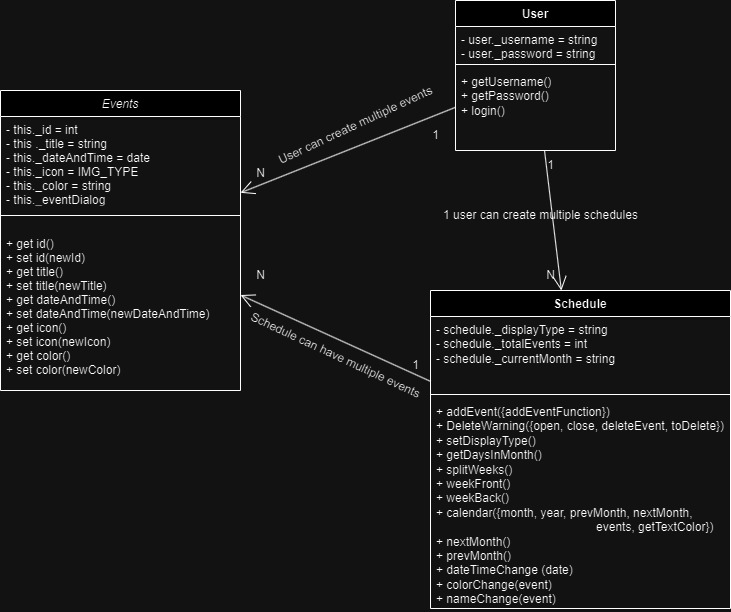
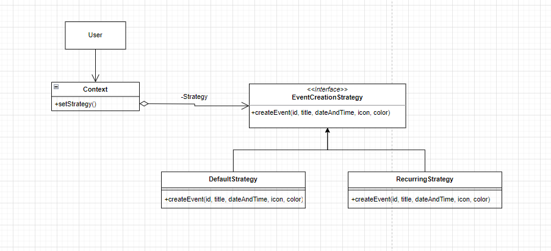
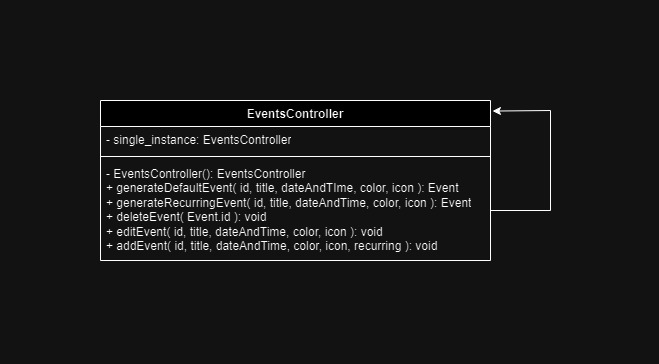

# Description
UI design is often built around the needs of neurotypical people. As a result, many apps miss UI features that improve ease of use for people with learning disabilities. One example of this is with Calendar apps, which, while extensive, often have complex UIs that aren't learning disability friendly. As a result, there should be a calendar app that prioritizes accessibility by following UI guidelines that accomodate those with learning disabilities. For those that have a learning disability who could greatly benefit from a scheduling app designed specifically with their needs in mind, TimeSculptor accommodates these needs by adhering to UI styling guidelines laid out by [Pavlov (2014)](https://www.scirp.org/html/7-9301792_43152.htm) and [Moreno et al. (2023)](https://link.springer.com/article/10.1007/s10209-023-00986-z). For example, Pavolv (2014) states that a key aspect of accesibile UIs is to ensure that all ideas have an associated picture. Apps like Google Calendar, Outlook, and Apple Calendar do not prioritize this, as events are typically just shown as text (with some niche exceptions like birthdays in Google Calendar). TimeSculptor will put these needs at the forefront, ensuring that the app adheres as closely as possible to them. Overall,
TimeSculptor is a scheduling app built for people with learning disabilities, our expected consumer segment. It provides a much easier and accessible interface that adheres to research based on building UI that is learning disability friendly.

The system requirements for TimeSculptor are defined thusly. First, **users** must be able to register with a valid _email_, _username_, and _password_. Each **user** will also **_have_** different personalized **settings**, which enable them to personalize their experience. For example, they can change their **notification** preferences, such as turning them _on/off_ or changing the _frequency_ at which notifications are sent. Each **notification** has a set _date_ it is sent out, as well as _content_ that will remind the **user** to update their **schedule**, and/or of upcoming **events**. Aside from this, the **user** can build a **schedule** that is **_tied to them_**, which is **_comprised_** of **days** will **_contain_** various **events**. The **schedule** will have different _view options_, such as list, daily, or weekly. The **schedule** also **_has_** inidividual **days**, which have a _date_, possible associated _holidays_, and have **events** that are **_scheduled within_** them. Each **event** **_contained_** within the **schedule** will have relevant information, like the _name_, _date_, _start time_, _end time_, _associated color_, and _related picture_. There are also **_recurring events_** which **_are a_** form of event that reoccur on a _time interval_, such as daily, weekly, or monthly. Another feature of TimeSculptor will be that it allows **users** to be **_friends_**, enabling users to compare their **schedules** via **compare requests**. In these **compare requests**, a **user** will **_initiate_** a request, which can then be **_accepted_** by another **user**. These **compare requests** will have a _header_, _content_, _sent date_, and _accepted date_. Once **_accepted_**, each of the **users** can use the **compare request** to **_view_** the other's **schedule** in order to schedule an **event** together.

# Architecture
Present a diagram of the high-level architecture of your system. Use a UML package diagram to describe the main modules and how they interrelate. See some examples at [here](https://www.uml-diagrams.org/package-diagrams-examples.html). Make clear the layers of your architecture (if they exist) as described in [here](https://www.uml-diagrams.org/multi-layered-application-uml-model-diagram-example.html). Provide a brief rationale of your architecture explaining why you designed it that way.

*Grading criteria (5 points): Adequate use of UML; Adequate design of an architecture for the system; Adequate description of the rationale.*

# Class Diagram

# Sequence Diagram
|Use Case 2 | Register/Login |
|:---|:---|
**Actors** | **User,** **TimeSculptor Web Application** |
**Register** | **The user navigates to the web application's homepage. On the homepage, the user clicks on the "Sign Up” button to start the registration process. The web application presents a registration form, which will probably includes fields such as: Full Name, Email Address, Password, Confirm Password. The user completes the registration form. If the input is valid, the web application creates a new user account and stores the provided information in the database. The web application sends a confirmation email to the user's provided email address containing a verification link. The user checks their email inbox, clicks on the verification link, and confirms their email address. Upon successful email verification, the web application displays a confirmation message to the user, informing them that their registration is complete.** |
**Login** | **The user navigates to the web application's homepage. On the homepage, the user clicks on the "Login" button to start the login process. The web application presents a login form, requesting the user's login info. The user enters their information into the login form. The web application verifies the entered credentials against the stored user data in the database. If the entered credentials are correct, the web application authenticates the user and grants access to their account. The user is redirected to the application's main dashboard or landing page.** |

*Grading criteria (5 points): Adequate use of UML; Adequate design of the sequence diagram; Consistency with the class diagram; Consistency with the use case description; Not including the use case description; Over simplistic diagram.*

# Design Patterns

### Strategy Design Pattern
- EventCreationStrategy: [Code](https://github.com/nickw409/TimeSculptor/blob/main/TimeSculptor/src/App.jsx)    
  

### Singleton Design Pattern
- EventsController: [Code](https://github.com/nickw409/TimeSculptor/blob/main/TimeSculptor/src/App.jsx)    
  

# Design Principles
How does your design observe the SOLID principles? Provide a short description of followed principles giving concrete examples from your classes.

*Grading criteria (6 points): Show correct understanding of SOLID principles; Provide enough details to justify how the design observes the SOLID principles.*
