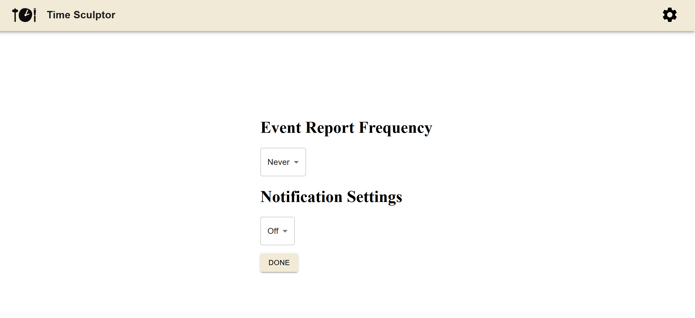
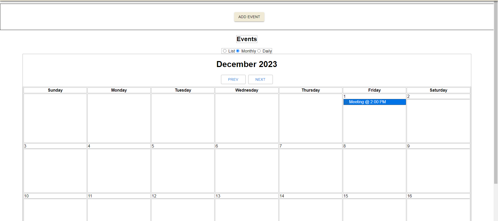
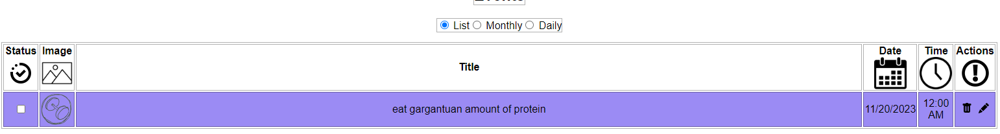

Group 4: **TimeSculptor**

**Date:** November 19, 2023

**Group Members:**

- Gabriel Valentin
- Izaac Molina
- Joey Banazsak
- Kimberly Allison
- Nicholas Wiley
- Noah Schwartz

# Introduction
 TimeSculptor is a scheduling app that aims to provide a seemless and user friendly experience, with a particular emphasis on being accessible for people with learning disabilities. It provides an accessible interface that adheres to guidelines outlined in [Pavlov (2014)](https://www.scirp.org/html/7-9301792_43152.htm) and [Moreno et al. (2023)](https://link.springer.com/article/10.1007/s10209-023-00986-z). The primary expected consumer segment individuals who possess learning disabilities, but this ultimately makes the app accessible for everyone. Upon logging in, you are then given the options to create events or edit your schedule's current events. You can utilize color coding, and assigning different symbols to your events. Additionally, there are three viewing modes: list, monthly, and daily.

[TimeSculptor](https://github.com/nickw409/TimeSculptor)

# Implemented Requirements

**Requirement:** Implement a settings menu with routing to the new page      
**Issue:** [#78](https://github.com/nickw409/TimeSculptor/issues/78), [#74](https://github.com/nickw409/TimeSculptor/issues/74)           
**Pull request:** [#81](https://github.com/nickw409/TimeSculptor/pull/81)    
**Implemented by:** Kimberly Allison      
**Approved by:** Izaac Molina   
**Settings Menu:**    
   

**Requirement:** Implement a monthly calendar view for events 
**Issue:** [#72](https://github.com/nickw409/TimeSculptor/issues/72)     
**Pull request:** [#71](https://github.com/nickw409/TimeSculptor/pull/71)
**Implemented by:** Izaac Molina
**Approved by:** Nick Wiley 
**Monthly View:**    
   

**Requirement:** Implement icons for the table in list view 
**Issue:** [#90](https://github.com/nickw409/TimeSculptor/issues/90)
**Pull request:** [#85](https://github.com/nickw409/TimeSculptor/pull/85)
**Implemented by:** Gabriel Valentin
**Approved by:** Izaac Molina
**Table Icons:**    
 

**Requirement:** Implement a daily view for events
**Issue:** [#75](https://github.com/nickw409/TimeSculptor/issues/75)   
**Pull request:** [#76](https://github.com/nickw409/TimeSculptor/pull/76)   
**Implemented by:** Izaac Molina
**Approved by:** Noah Shwartz
**Daily View:**    
   

# Tests

For the testing of our program we decided to use jest as our automated testing software. 

link for testing: [Here](https://github.com/nickw409/TimeSculptor/tree/main/TimeSculptor/src/components/__tests__)

an example of a test case is the [calendar.jsx](https://github.com/nickw409/TimeSculptor/tree/main/TimeSculptor/src/components/calendar.jsx) file, in our tests, the first test in the [calendar.test.js](https://github.com/nickw409/TimeSculptor/tree/main/TimeSculptor/src/components/__tests__/calendar.test.js) file is seeing that the correct month is displayed based on a set of mock events and date. 

Below is the output of the current tests being ran:

# Demo

# Code Quality

To foster code quality, we implemented a system where all major components and functions are commented with their purpose, along with the parameters they receive and value(s) they return. Additionally, we also refactored our code to specifically follow SOLID principles, such as how the Event class has the single responsibility of holding data for each displayed event. Finally, we are also using the linter provided by [StandardJS](https://github.com/standard/standard) which is a common linter for .js and .jsx code. This has allowed us to follow a common and uniform style guide for our codebase.

# Lessons Learned

Throughout the course of creating this second release, we have further deepened our knowledge of React. Particularly, we learned a lot about Routing in react, which allowed us to implement the settings page, as well as how to format a calendar in react, which is now part of the events display. Our overall progress in learning these technologies is tangible, which has been great getting to experienve. However, one problem that arose was finding a more streamlined way to implement coding standards, such as a style guide. Implementing the style guide was very time consuming, and in the future, we want to find ways to better automate this process. Additionally, we also had a hard time refactoring the code to follow particular design patterns and principles, so we also want to look more into how we can refactor our code to follow more standardized design. Finally, we started working on implementing a database for the project, but have ultimately ran into issues completely hooking it up to the front end to update the database and preserve login states, which is our biggest priority for next release.

