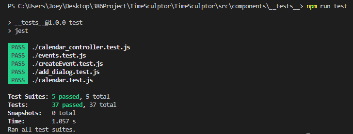
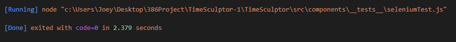

# Description
TimeSculptor is a scheduling app that aims to provide a seemless and user friendly experience, with a particular emphasis on being accessible for people with learning disabilities. It provides an accessible interface that adheres to guidelines outlined in [Pavlov (2014)](https://www.scirp.org/html/7-9301792_43152.htm) and [Moreno et al. (2023)](https://link.springer.com/article/10.1007/s10209-023-00986-z). The primary expected consumer segment individuals who possess learning disabilities, but this ultimately makes the app accessible for everyone. Upon logging in, you are then given the options to create events or edit your schedule's current events. You can utilize color coding, and assigning different symbols to your events. Additionally, there are three viewing modes: list, monthly, and daily.

[TimeSculptor](https://github.com/nickw409/TimeSculptor)

# Verification
For the testing of our program we decided to use jest as our automated testing software. 

link for testing: [Here](https://github.com/nickw409/TimeSculptor/tree/main/TimeSculptor/src/components/__tests__)

an example of a test case is the [calendar.jsx](https://github.com/nickw409/TimeSculptor/tree/main/TimeSculptor/src/components/calendar.jsx) file, in our tests, the first test in the [calendar.test.js](https://github.com/nickw409/TimeSculptor/tree/main/TimeSculptor/src/components/__tests__/calendar.test.js) file is seeing that the correct month is displayed based on a set of mock events and date. 

Below is the output of the current tests being ran:

# Acceptance Test
For our acceptance test we used selenium to test our program

link for testing: [Here](https://github.com/nickw409/TimeSculptor/tree/main/TimeSculptor/src/components/__tests__)

An example of an acceptance test is in the [loginTest.js](https://github.com/nickw409/TimeSculptor/tree/main/TimeSculptor/src/components/__tests__/loginTest.js) file, where we test that the login page, created in the [login.jsc](https://github.com/nickw409/TimeSculptor/tree/main/TimeSculptor/src/login.jsx) file correctly gets the credentials from the user and logs in.

Below is the output of the test being conducted:

# Validation
**Script:**
User Tasks
1. Ask the user to log in to TimeSculptor
Notes/Observations:____________________________________
1. Ask the user to create an event
Notes/Observations:__________________________________________
2. Ask the user to navigate between task and calendar view
Notes/Observations:__________________
3. Ask the user to edit their event
Notes/Observations:_______________________________
4. Ask the user to delete their event
Notes/Observations:_______________________________
5. Ask the user to change and save new settings preferences
Notes/Observations:____________________________________________
Questions
1. On a scale of 1-10, how user-friendly is TimeSculptor?
1 2 3 4 5 6 7 8 9 10
2. How were TimeSculptors customization options?
____________________________________________________________________________
What customization options did you like?
________________________________
What customization options did you dislike?
___________________________________________
How does TimeSculptor compare to other task management apps such as Google
Calendar/Outlook?
______________________
Are there any features of TimeSculptor that you liked?
_____________
Are there any features of TimeSculptor that you disliked?
_______________
On a scale of 1-10, how likely would you be to use TimeSculptor?
1 2 3 4 5 6 7 8 9 10

**Results:** 

*Interview 1:*

Interviewer: Noah Schwartz

Interviewee: Graham Jacoby (does have diagnosed ADHD)

General Overview of Interview: 

- Liked the calendar view
- Disliked the navigation to color and icon choosing
- Liked the color customization to differentiate between events
- Thinks the "Pick a Time" button would be nice for those events hard to prioritize due to ADHD 
- Found the icons to not be super useful, maybe due in part to size or limited choices
- Doesn't think he'd use it over his current choice of application just due to the fact that it's still a prototype
    
*Interview 2:*

Interviewer: Kimberly Allison

Interviewee: Kelsey Allison (does have diagnosed ADHD)

General Overview of Interview: 

- Disliked that event dates and times couldn't be manually entered
- Noted that the titles for the settings options weren't explained and could be a little confusing
- Liked the different ways that events could be viewed, specifically the list view
- Thinks that icons were nice but couldn't see herself using them personally
- Suggested having a box to check that makes an event last all day
- Suggested having more font options
- Prefers using her phone calendar over TimeSculptor in its current state

**Reflections:** Reflect on what you observed. Some questions that you can explore: What features worked well? What can be changed? How is the learning curve of your system? Did the users perform the tasks as you expected? Did the users’ actions produce the results they expected? What did the users like the most? Is your value proposition accomplished? 

Grading criteria (17 points): adequate script, adequate report of the results, adequate reflection, language.
